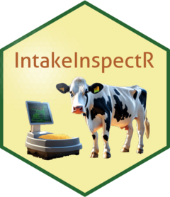

<!-- README.md is generated from README.Rmd. Please edit that file -->

# IntakeInspectR {align="center"}

# {align="center" alt="" height="139"}


```{r, include = FALSE}
knitr::opts_chunk$set(
  collapse = TRUE,
  comment = "#>",
  fig.path = "man/figures/README-",
  out.width = "100%"
)
```

<!-- badges: start -->

<!-- badges: end -->

IntakeInspectR is designed to help researchers analyse and visualise automatically collected raw feed intake data for ruminants. It has been developed to work with data from Insentec feed bins and contains a user friendly ShinyApp that is a great place to start.

## ShinyApp

The ShinyApp within the `IntakeInspectR` package is currently hosted in 2 locations on shinyapps.io:

> -   <https://agrifooddatacanada.shinyapps.io/IntakeInspectR/>
> -   <https://dave-innes-uog.shinyapps.io/IntakeInspectR/>

## Installation

You can install IntakeInspectR from [GitHub](https://github.com/) with:

``` r
# install.packages("remotes")
remotes::install_github("CNM-University-of-Guelph/IntakeInspectR")
```

## Run ShinyApp locally

When using RStudio you can also run the `IntakeInsepctR` app directly on your computer with:

``` r
IntakeInspectR::run_app()
```

## Acknowledgements

*This work was supported by the Canada First Research Excellence Fund (CFREF-2015-00004) under grant number THE2-020.*

*This software was developed in part using data from the Ontario Dairy Research Centre, which is owned by the Agricultural Research Institute of Ontario and managed by the University of Guelph through the Ontario Agri-Food Innovation Alliance. The Government of Ontario does not provide any warranty of any kind regarding the accuracy, completeness, security or reliability of the material posted therein or provided through any sites linked directly or indirectly to the site.*

# Manual analysis using built-in functions

It is also possible to access the functions that execute all of the cleaning steps. The following is a step-by-step guide to replicate many of the functions available in the ShinyApp.

```{r message=FALSE, warning=FALSE}
library(dplyr)
library(ggplot2)
```

## 1. Upload Data

Load demo data from package

```{r}
df_uploaded <- IntakeInspectR::demo_insentec_data

```

View data layout:

```{r}
df_uploaded %>% glimpse()
```

### Custom data

If using data stored in .DAT, .CSV or .TXT then some additional steps are required to ensure that the date/times are formatted correctly.

#### Insentec DAT files

Firstly, .DAT files from the Insentec system normally hold all data for a single day, with the date stored only in the file name. Normally they do not have column names either. The built in function `fct_import_DAT_default` can be used for importing these files, or inspect the code in this function to modify as-required. This function will also format dates/times.

``` r
list_of_paths_DAT <- list.files("./path_to/DAT files", pattern = ".DAT", full.names = TRUE)
list_of_names_DAT <- list.files("./path_to/DAT files", pattern = ".DAT")

example_import <- 
  fct_import_DAT_default(.x = list_of_paths_DAT,
                         .y = list_of_names_DAT)
```

#### Manually importing .csv files

This code assumes you have some .csv files all in the same folder, which are then each imported into a list of data frames. This list is then bound into a single data frame (assumes all column names were the same), and then the start_time, end_time and date are formatted. This example assumes that the start_time and end_time are characters with the format HH:MM:SS or similar, which are concatenated with a date column that has the format YYYY-MM-DD or similar (see `?lubridate::ymd_hms` for more information about parsing formats).

``` r
# Get file paths to use for iterating 
list_of_paths_CSV <- list.files("./path_to/CSV files", pattern = ".csv", full.names = TRUE)

# give each file path to the fread function (or read_csv(), etc)
list_of_dfs <- purrr::map(list_of_paths_CSV, ~data.table::fread(.x))

df_uploaded_example <- 
  list_of_dfs %>% 
  # bind into 1 df:
  purrr::list_rbind() %>%
  # then, reformate date and times columns:
  dplyr::mutate(
    dplyr::across(c(start_time, end_time), ~ lubridate::ymd_hms(stringr::str_c(date, .x, sep = "_"))),
    date = lubridate::ymd(date)
    )
```

### Initial plot

Plot 30k rows of data for a quick look at data.

```{r}
df_uploaded %>% 
  slice_head(n=30000) %>% 
  IntakeInspectR::f_plot_summary(
    x = duration_sec/60,
    y = intake,
    col_colour = NULL,
    type = 'reg'
  )+
  labs(x = 'Feed Duration (min)',
       y = 'Intake (kg as-fed)')+
  geom_hline(aes(yintercept = 0), colour = 'darkred')


  
```

### Filter data

Get min and max dates for reference

```{r}
min_date <- df_uploaded$date %>% min()
max_date <- df_uploaded$date %>% max()

print(min_date)
print(max_date)

```

Filter data to include from `min_date` to 05 Jan 2021:

```{r}

df_filtered <- 
  df_uploaded %>% 
        dplyr::filter(date >= lubridate::ymd(min_date) &  date <= lubridate::ymd("2022-01-05")) 

# Print dimensions of filtered data:
df_filtered %>% dim()

```

## 2a. By Bin - Clean

This function will return a list of data frames:

-   'df_0kg'
-   'df_step2_errors'
-   'df_cleaned'

In addition, if log = TRUE 'log_path' is returned in the list, which is the temporary file path where the log is stored. When running interactively it also prints the logs to the console.

```{r echo=TRUE, results='hide'}

list_cleaned <-
        IntakeInspectR::f_by_bin_clean(
          df_filtered,
          zero_thresh = 0.3, 
          feedout_thresh = 10, 
          col_bin_ID = bin_id,
          col_animal_id = animal_id,
          col_date = date,
          col_start_time = start_time,
          col_end_time = end_time,
          col_start_weight_kg = start_weight_kg,
          col_end_weight_kg = end_weight_kg,
          col_intake = intake,
          log = FALSE
          )

```

### Added columns

The classifications and changes made in 'By Bin - Clean' are added to the original data, minus the rows stored in `df_0kg` and `df_step2_errors`. Use the \$ symbol to access individual elements of the output by name.

The columns ending in `_bybin` represent columns where corrections were made, as well `is_end_time_overlap_error`. These columns use the classifications to make corrections, e.g. If `check_end_weight_kgs` starts with `'replace: '` then `corrected_end_weight_kg_bybin` will be given the value of the next row's start weight. Otherwise, it keeps the original `end_weight_kg`.

```{r}
list_cleaned$df_cleaned %>% glimpse()
```

## 2b. By Bin - Visualise

### Overall Plots

#### Regression (raw with classifications)

```{r fig.width=8}

list_cleaned$df_cleaned %>% 
  IntakeInspectR::f_plot_summary(
    x = duration_sec,
    y = intake,
    type = 'reg')+
  ggplot2::labs(
    x = 'Feed duration (sec)',
    y = 'Intake (kg)')

```

#### Histogram (raw)

```{r fig.width=8, warning=FALSE, message=FALSE}

list_cleaned$df_cleaned %>% 
  IntakeInspectR::f_plot_summary(
     x = duration_sec,
    y = intake,
    type = 'hist')

```

### Individual bin plots

These functions require data from only 1 feed bin. Various columns contain useful information about the cleaning, such as 'check_end_weight_kgs', 'is_end_time_error', 'check_start_weight_kgs', 'is_corrected_bybin'. These can be used for col_colour to colour the points in the plot.

These functions return static ggplot2 objects. But they can be made interactive using plotly.

```{r fig.width=8}
p_bin_regression_raw <- 
  list_cleaned$df_cleaned %>% 
  dplyr::filter(bin_id == 16) %>% 
  dplyr::mutate(
    tooltip = paste('animal_id:', .data$animal_id,
                    '\nstart_time', .data$start_time)
  ) %>% 
  IntakeInspectR::plot_bin_regression(
    x = duration_sec,
    y = intake,
    col_colour = check_end_weight_kgs,
    col_hover_text = .data$tooltip)+
  # add custom labels:
  ggplot2::labs(
    x = 'Feed duration (sec)',
    y = 'Intake (kg)',
    title = 'Feed Bin 16')
  

  
 # plotly::ggplotly(p_bin_regression_raw)
p_bin_regression_raw
```

### Timeline (raw with classifications)

These are better viewed interactively with plotly, or filter the dates to a smaller time frame to focus in on certain errors.

```{r fig.width=9}
p_bin_timeline_raw <- 
  list_cleaned$df_cleaned %>% 
  # filter to specific dates if not using interactively
  dplyr::filter(date == lubridate::ymd("2022-01-02")) %>%
  dplyr::filter(bin_id == 16) %>% 
  dplyr::mutate(
    # For plotly when hovering over a point
    tooltip = paste('animal_id:', .data$animal_id,
                    '\nstart_time', .data$start_time)
  ) %>% 
  IntakeInspectR::plot_bin_timeline(
    col_start_time = start_time,
    col_end_time = end_time,
    col_start_weight_kg = start_weight_kg,
    col_end_weight_kg = end_weight_kg,
    col_colour = check_end_weight_kgs,
    col_hover_text = .data$tooltip)+
  # add custom labels:
  ggplot2::labs(
    x = 'Time',
     y = 'Bin Weight (kg)',
    title = 'Feed Bin 16')

  
# plotly::ggplotly(p_bin_timeline_raw)
p_bin_timeline_raw
```

### Timeline (cleaned with classifications)

```{r fig.width=8}
p_bin_timeline_clean <- 
  list_cleaned$df_cleaned %>% 
  dplyr::filter(bin_id == 16) %>% 
  # filter to specific dates if not using interactively
  dplyr::filter(date == lubridate::ymd("2022-01-02")) %>%
  dplyr::mutate(
    # For plotly when hovering over a point
    tooltip = paste('animal_id:', .data$animal_id,
                    '\nstart_time', .data$start_time)
  ) %>% 
  IntakeInspectR::plot_bin_timeline(
    col_start_time = start_time,
    col_end_time = corrected_end_time,
    col_start_weight_kg = corrected_start_weight_kg_bybin,
    col_end_weight_kg = corrected_end_weight_kg_bybin,
    col_colour = check_end_weight_kgs,
    col_hover_text = .data$tooltip)+
  # add custom labels:
  ggplot2::labs(
    x = 'Time',
     y = 'Bin Weight (kg)',
    title = 'Feed Bin 16 - Cleaned')

  
# plotly::ggplotly(p_bin_timeline_clean)
p_bin_timeline_clean
```

## 3a. By Animal - Clean

This function takes the whole cleaned data frame, and splits by animal to iterate through regression functions.

```{r}
by_animal_list_out <- 
 IntakeInspectR::f_iterate_animals(
    list_cleaned$df_cleaned,
    col_animal_id = animal_id,
    col_bin_id = bin_id,
    col_date = date,
    col_start_time =  start_time,
    col_intake =  corrected_intake_bybin,
    col_duration = corrected_duration_sec,
    sd_thresh = 20, 
    max_duration_min = 60,
    min_intake_rate_kg_min = 0.05,
    max_intake_rate_kg_min = 1.5,
    outlier_exemption_max_duration = 1,
    outlier_exemption_max_intake = 0.2,
    shiny.session = NULL, # use NULL if not inside a shiny app
    log = FALSE,
    verbose = FALSE
  )

```

This data is returned as a nested data frame. This makes many operations easier but users may prefer a normal data frame:

```{r message=FALSE}
merged_by_animal <- 
  by_animal_list_out$nested_out %>% 
  IntakeInspectR:::f_merge_corrected_outlier_data()

merged_by_animal %>% glimpse()
```

## 3b. By Animal - Vis

### Overall

This shows all changes made at a per animal level but displayed together on this single plot for an overview.

```{r fig.width=8}

merged_by_animal %>%
   IntakeInspectR:::fct_plot_by_animal_overall(
    col_intake = corrected_intake_bybin,
    col_duration = corrected_duration_sec,
    pt_size = 3)+
  labs(x = 'Corrected Feed Duration (seconds)',
       y = 'Corrected Feed Intake (kg)')

```

### Individual animal

#### Find some animals with errors

```{r}
merged_by_animal %>% 
  dplyr::count(.data$animal_id, .data$outlier_pos_neg) %>% 
  dplyr::mutate(dplyr::across('outlier_pos_neg', ~tidyr::replace_na(.x, 'not_error'))) %>%
  tidyr::pivot_wider(names_from = 'outlier_pos_neg', values_from = 'n') %>%
        dplyr::rowwise() %>%
        dplyr::mutate(total_outliers = sum(
          dplyr::c_across(colnames(.)[colnames(.) %in% c('neg', 'neg_intake' , 'neg_duration', 'pos')] # sum only the cols available
          ), na.rm = TRUE)) %>%
        dplyr::ungroup() %>%
        dplyr::arrange(dplyr::desc(.data$total_outliers))


```

#### Visualise some individual animals

```{r fig.height=9, fig.width=12, message=FALSE, warning=FALSE}
merged_by_animal %>%
  filter(animal_id %in% c(2040,2043,2107,2007)) %>% 
  IntakeInspectR::fct_plot_by_animal(
    max_intake_rate_kg_min = 1.5,
    min_intake_rate_kg_min = 0.05,
    outlier_exemption_max_duration = 1,
    outlier_exemption_max_intake = 0.3,
    col_intake = .data$corrected_intake_bybin,
    col_duration = .data$corrected_duration_sec,
    pt_size = 3)+
  labs(x = 'Corrected Feed Duration (seconds)',
       y = 'Corrected Feed Intake (kg)')  +
  facet_wrap(vars(animal_id), scales = 'free')

```

## 4. Final Output - Select errors to correct for

Because all classifications and changes are stored in columns, users may correct data using any combination of corrections.

### Select most useful columns

```{r}

df_all_steps <- 
  merged_by_animal %>% 
  dplyr::select(
    bin_id,
    animal_id,
    date,
    start_time,
    end_time,
    duration_sec,
    start_weight_kg,
    end_weight_kg,
    
    # By Bin - End weight:
    check_end_weight_kgs,
    category_end_weight_kg,
    corrected_end_weight_kg_bybin,
    
    # By Bin - Start weight:
    check_start_weight_kgs,
    corrected_start_weight_kg_bybin,
    
    is_corrected_intake_bybin,
    
    # By Bin - Overlapping end times:
    is_end_time_overlap_error,
    corrected_end_time,
    corrected_duration_sec,
    
    # By Animal - Outlier detection
    is_manual_outlier,
    manual_outlier_classification,
    is_outlier,
    outlier_pos_neg,
    new_x,
    new_y
  )

df_all_steps %>% glimpse()
```

### Keep only corrected end weight and end time

This is an example of selecting a final intake that ignores fixing start weight errors or outlier detection (By Animal), but does correct for long durations where feeding events by a animal overlapped at different feed bins.

```{r}
df_all_steps %>% 
  # calculate new intakes and durations:
  mutate(
    selected_final_intake_kg = start_weight_kg - corrected_end_weight_kg_bybin,
    selected_final_duration_sec = corrected_end_time - start_time
  ) %>% 
  # remove unwanted columns:
  dplyr::select(
    bin_id, animal_id, date, start_time, corrected_end_time, start_weight_kg, corrected_end_weight_kg_bybin,
    selected_final_intake_kg, selected_final_duration_sec
  ) %>% 
  glimpse()
```

### Keeping all corrections

The columns `new_x` and `new_y` are automatically copied into columns with more meaningful names: `final_intake_kg` and `final_duration_sec`. In addition, we can add a column to check if anything was modified from pre-calcualted flags:

```{r}
simplified_final_df <- 
  merged_by_animal %>% 
  dplyr::rowwise() %>%
  dplyr::mutate(
    # overall flag for if anything was modified in the event
    is_modified = any(is_corrected_intake_bybin, is_end_time_overlap_error, is_outlier, na.rm=TRUE)
  ) %>% 
  dplyr::ungroup() %>% 
  dplyr::select(
    bin_id, animal_id, date, start_time, corrected_end_time, start_weight_kg, corrected_end_weight_kg_bybin,
    final_intake_kg, 
    final_duration_sec, 
    is_modified
  )

simplified_final_df %>% glimpse()
```

### Notes on By Animal outlier detection

The By Animal functions require an x axis (duration) and y axis (intake) to be specified for it to use for fitting regressions.Therefore, it is not possible to exclude some error types from the By Bin cleaning after running the By Animal functions, instead users should re-run `f_iterate_animals` and specify the columns they wish to use. For example:

```{r eval=FALSE}
list_cleaned$df_cleaned %>% 
  mutate(
    selected_intake_kg_bybin = start_weight_kg - corrected_end_weight_kg_bybin,
    # Notice time diff is converted to a number with as.numeric():
    selected_duration_sec_bybin =   as.numeric(corrected_end_time - start_time) 
  ) %>% 
  # Re-run with new columns:
 IntakeInspectR::f_iterate_animals(
    col_animal_id = animal_id,
    col_bin_id = bin_id,
    col_date = date,
    col_start_time =  start_time,
    col_intake =  selected_intake_kg_bybin, # NEW column
    col_duration = selected_duration_sec_bybin, # NEW column
    sd_thresh = 5, 
    shiny.session = NULL, # use NULL if not inside a shiny app
    log = FALSE
  )
```

## 5. Daily Intakes

Assuming we are using all corrections and the 'simplified' data frame we calculated, we can easily calculate daily intakes:

```{r message=FALSE}

daily_intakes <- 
  simplified_final_df  %>% 
  group_by( animal_id, date ) %>% 
  summarise(
    daily_intake_kg_asfed = sum(final_intake_kg, na.rm=TRUE)
  )

daily_intakes


```

### Visualise all daily intakes

```{r}
daily_intakes %>% 
  ggplot(aes( x = date, y = daily_intake_kg_asfed, group = date))+
  geom_violin(colour='orange',linewidth=1.5)+
  geom_jitter(alpha=0.5, width=0.2)+
  theme_classic()
```

### Visualise per animal daily intake

It can be useful to monitor daily feed intake over time and a low intake might be important to follow up on.

```{r}
daily_intakes %>% 
  arrange(daily_intake_kg_asfed) %>% 
  head(10)
```

```{r}
daily_intakes %>% 
  filter(animal_id %in% c(2126, 2072, 2121, 2100)) %>% 
  ggplot(aes( x = date, y = daily_intake_kg_asfed))+
  geom_point()+
  geom_line()+
  facet_wrap(vars(animal_id))+
  ggplot2::ylim(c(0,NA))+
  theme_classic()
```
