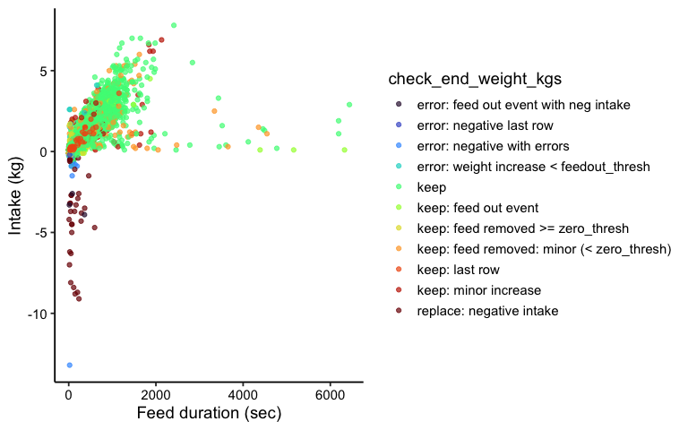
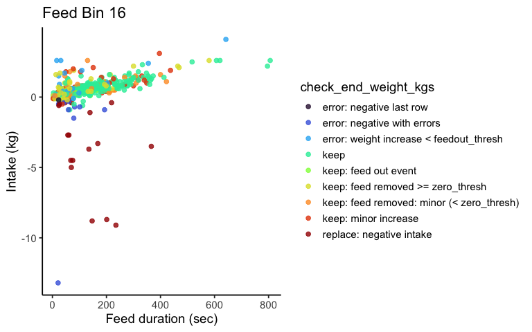
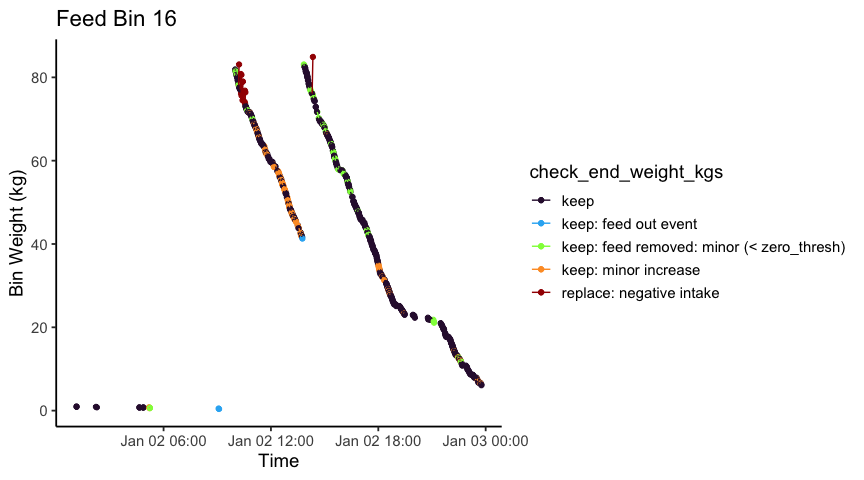
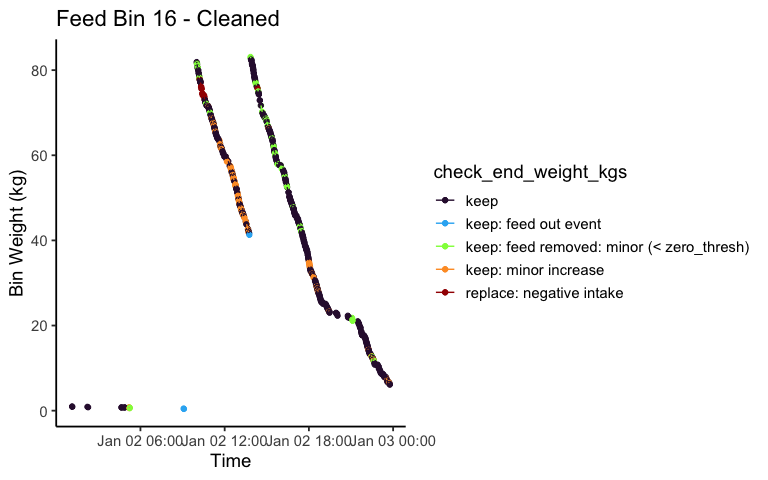
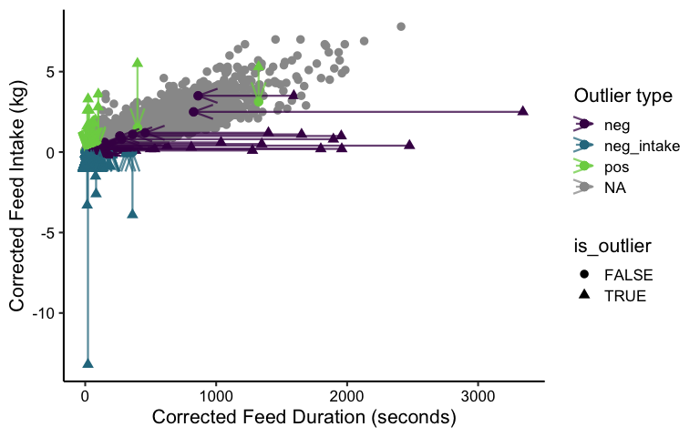
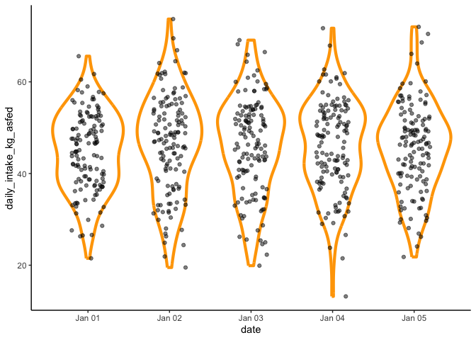
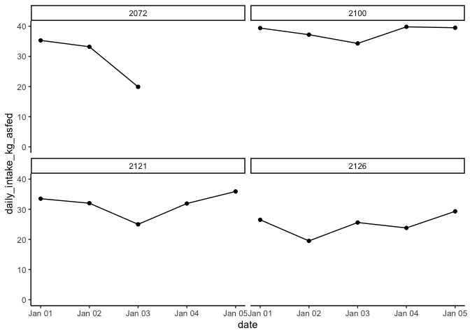

<!-- README.md is generated from README.Rmd. Please edit that file -->

# IntakeInspectR

<!-- badges: start -->
<!-- badges: end -->

IntakeInspectR is designed to help researchers analyse and visualise
automatically collected raw feed intake data for ruminants. It has been
developed to work with data from Insentec feed bins and contains a user
friendly ShinyApp that is a great place to start.

## ShinyApp

The ShinyApp within the `IntakeInspectR` package is currently hosted in
2 locations on shinyapps.io:

> - <https://agrifooddatacanada.shinyapps.io/IntakeInspectR/>
> - <https://dave-innes-uog.shinyapps.io/IntakeInspectR/>

## Installation

You can install IntakeInspectR from [GitHub](https://github.com/) with:

``` r
# install.packages("remotes")
remotes::install_github("CNM-University-of-Guelph/IntakeInspectR")
```

## Run ShinyApp locally

When using RStudio you can also run the `IntakeInsepctR` app directly on
your computer with:

``` r
IntakeInspectR::run_app()
```

## Acknowledgements

*This work was supported by the Canada First Research Excellence Fund
(CFREF-2015-00004) under grant number THE2-020.*

*This software was developed in part using data from the Ontario Dairy
Research Centre, which is owned by the Agricultural Research Institute
of Ontario and managed by the University of Guelph through the Ontario
Agri-Food Innovation Alliance. The Government of Ontario does not
provide any warranty of any kind regarding the accuracy, completeness,
security or reliability of the material posted therein or provided
through any sites linked directly or indirectly to the site.*

# Manual analysis using built-in functions

It is also possible to access the functions that execute all of the
cleaning steps. The following is a step-by-step guide to replicate many
of the functions available in the ShinyApp.

``` r
library(dplyr)
library(ggplot2)
```

## 1. Upload Data

Load demo data from package

``` r
df_uploaded <- IntakeInspectR::demo_insentec_data
```

View data layout:

``` r
df_uploaded %>% glimpse()
#> Rows: 94,026
#> Columns: 11
#> $ transponder_id <int64> 6.448698e-317, 6.448695e-317, 6.629925e-317, 6.448712…
#> $ feed_bin_id    <int> 6, 2, 41, 7, 1, 72, 71, 41, 53, 16, 1, 42, 41, 49, 8, 2…
#> $ start_time     <dttm> 2022-01-01 00:04:20, 2022-01-01 00:03:55, 2022-01-01 0…
#> $ end_time       <dttm> 2022-01-01 00:04:32, 2022-01-01 00:04:41, 2022-01-01 0…
#> $ feed_duration  <int> 12, 46, 39, 118, 26, 127, 136, 138, 206, 118, 140, 309,…
#> $ start_weight   <dbl> 0.4, 3.3, 32.1, 35.7, 13.5, 8.9, 17.7, 31.9, 21.4, 7.4,…
#> $ end_weight     <dbl> 0.3, 3.1, 31.9, 35.2, 13.3, 8.7, 17.4, 31.3, 20.9, 7.0,…
#> $ diet           <chr> "DIET1", "DIET1", "DIET1", "DIET1", "DIET1", "DIET1", "…
#> $ intake         <dbl> 0.1, 0.2, 0.2, 0.5, 0.2, 0.2, 0.3, 0.6, 0.5, 0.4, 0.6, …
#> $ date           <date> 2022-01-01, 2022-01-01, 2022-01-01, 2022-01-01, 2022-0…
#> $ cow_id         <dbl> 2000, 2001, 2002, 2003, 2001, 2004, 2005, 2002, 2006, 2…
```

### Initial plot

Plot 30k rows of data for a quick look at data.

``` r
df_uploaded %>% 
  slice_head(n=30000) %>% 
  IntakeInspectR::f_plot_summary(
    x = feed_duration/60,
    y = intake,
    col_colour = NULL,
    type = 'reg'
  )+
  labs(x = 'Feed Duration (min)',
       y = 'Intake (kg as-fed)')+
  geom_hline(aes(yintercept = 0), colour = 'darkred')
```


### Filter data

Get min and max dates for reference

``` r
min_date <- df_uploaded$date %>% min()
max_date <- df_uploaded$date %>% max()

print(min_date)
#> [1] "2022-01-01"
print(max_date)
#> [1] "2022-01-07"
```

Filter data to include from `min_date` to 05 Jan 2021:

``` r

df_filtered <- 
  df_uploaded %>% 
        dplyr::filter(date >= lubridate::ymd(min_date) &  date <= lubridate::ymd("2022-01-05")) 

# Print dimensions of filtered data:
df_filtered %>% dim()
#> [1] 67224    11
```

## 2a. By Bin - Clean

This function will return a list of data frames:

- ‘df_0kg’
- ‘df_step2_errors’
- ‘df_cleaned’

In addition, if log = TRUE ‘log_path’ is returned in the list, which is
the temporary file path where the log is stored. When running
interactively it also prints the logs to the console.

``` r

list_cleaned <-
        IntakeInspectR::f_by_bin_clean(
          df_filtered,
          zero_thresh = 0.3, 
          feedout_thresh = 10, 
          col_bin_ID = feed_bin_id,
          col_date = date,
          col_start_time = start_time,
          col_start_weight = start_weight,
          col_end_weight = end_weight,
          col_intake = intake,
          log = FALSE
          )
```

### Added columns

The classifications and changes made in ‘By Bin - Clean’ are added to
the original data, minus the rows stored in `df_0kg` and
`df_step2_errors`. Use the \$ symbol to access individual elements of
the output by name.

The columns ending in `_bybin` represent columns where corrections were
made, as well `is_end_time_overlap_error`. These columns use the
classifications to make corrections, e.g. If `check_end_weights` starts
with `'replace: '` then `corrected_end_weight_bybin` will be given the
value of the next row’s start weight. Otherwise, it keeps the original
`end_weight`.

``` r
list_cleaned$df_cleaned %>% glimpse()
#> Rows: 60,056
#> Columns: 32
#> $ transponder_id                  <int64> 6.448712e-317, 6.448697e-317, 6.4487…
#> $ feed_bin_id                     <int> 7, 42, 48, 18, 2, 49, 53, 41, 6, 71, 7…
#> $ start_time                      <dttm> 2022-01-01 00:03:10, 2022-01-01 00:03…
#> $ end_time                        <dttm> 2022-01-01 00:05:08, 2022-01-01 00:08…
#> $ feed_duration                   <int> 118, 309, 470, 372, 46, 306, 206, 39, …
#> $ start_weight                    <dbl> 35.7, 31.0, 24.0, 5.5, 3.3, 32.4, 21.4…
#> $ end_weight                      <dbl> 35.2, 29.4, 22.3, 4.1, 3.1, 31.7, 20.9…
#> $ diet                            <chr> "DIET1", "DIET1", "DIET1", "DIET1", "D…
#> $ intake                          <dbl> 0.5, 1.6, 1.7, 1.4, 0.2, 0.7, 0.5, 0.2…
#> $ date                            <date> 2022-01-01, 2022-01-01, 2022-01-01, 2…
#> $ cow_id                          <dbl> 2003, 2008, 2016, 2011, 2001, 2009, 20…
#> $ is_0kg                          <lgl> FALSE, FALSE, FALSE, FALSE, FALSE, FAL…
#> $ prevEnd                         <dbl> NA, NA, NA, NA, NA, NA, NA, NA, NA, NA…
#> $ prevStart                       <dbl> NA, NA, NA, NA, NA, NA, NA, NA, NA, NA…
#> $ nextEnd                         <dbl> 35.1, 29.4, 22.4, 4.1, 3.1, 31.7, 20.9…
#> $ nextStart                       <dbl> 35.1, 29.4, 22.4, 4.1, 3.1, 31.7, 20.9…
#> $ prevEnd_vs_nextStart            <dbl> NA, NA, NA, NA, NA, NA, NA, NA, NA, NA…
#> $ check_prev_vs_next              <chr> "ok", "ok", "ok", "ok", "ok", "ok", "o…
#> $ classify_errors                 <chr> "ok", "ok", "ok", "ok", "ok", "ok", "o…
#> $ check_end_weights               <chr> "keep: feed removed: minor (< zero_thr…
#> $ corrected_end_weight_bybin      <dbl> 35.2, 29.4, 22.4, 4.1, 3.1, 31.7, 20.9…
#> $ category_end_weight             <chr> "keep", "keep", "replace", "keep", "ke…
#> $ prev_step3_check                <chr> NA, NA, NA, NA, NA, NA, NA, NA, NA, NA…
#> $ check_start_weights             <chr> "keep", "keep", "keep", "keep", "keep"…
#> $ corrected_start_weight_bybin    <dbl> 35.7, 31.0, 24.0, 5.5, 3.3, 32.4, 21.4…
#> $ corrected_intake_bybin          <dbl> 0.5, 1.6, 1.6, 1.4, 0.2, 0.7, 0.5, 0.2…
#> $ is_corrected_intake_bybin       <lgl> FALSE, FALSE, TRUE, FALSE, FALSE, FALS…
#> $ nextStartTime                   <dttm> 2022-01-01 00:05:15, 2022-01-01 00:09…
#> $ is_end_time_overlap_error       <lgl> FALSE, FALSE, FALSE, FALSE, FALSE, FAL…
#> $ corrected_end_time              <dttm> 2022-01-01 00:05:08, 2022-01-01 00:08…
#> $ corrected_feed_duration_diff    <drtn> 118 secs, 309 secs, 470 secs, 372 sec…
#> $ corrected_feed_duration_seconds <dbl> 118, 309, 470, 372, 46, 306, 206, 39, …
```

## 2b. By Bin - Visualise

### Overall Plots

#### Regression (raw with classifications)

``` r

list_cleaned$df_cleaned %>% 
  IntakeInspectR::f_plot_summary(
    x = feed_duration,
    y = intake,
    type = 'reg')+
  ggplot2::labs(
    x = 'Feed duration (sec)',
    y = 'Intake (kg)')
```



#### Histogram (raw)

``` r

list_cleaned$df_cleaned %>% 
  IntakeInspectR::f_plot_summary(
     x = feed_duration,
    y = intake,
    type = 'hist')
```


### Individual bin plots

These functions require data from only 1 feed bin. Various columns
contain useful information about the cleaning, such as
‘check_end_weights’, ‘is_end_time_error’, ‘check_start_weights’,
‘is_corrected_bybin’. These can be used for col_colour to colour the
points in the plot.

These functions return static ggplot2 objects. But they can be made
interactive using plotly.

``` r
p_bin_regression_raw <- 
  list_cleaned$df_cleaned %>% 
  dplyr::filter(feed_bin_id == 16) %>% 
  dplyr::mutate(
    tooltip = paste('cow_id:', .data$cow_id,
                    '\nstart_time', .data$start_time)
  ) %>% 
  IntakeInspectR::plot_bin_regression(
    x = feed_duration,
    y = intake,
    col_colour = check_end_weights,
    col_hover_text = .data$tooltip)+
  # add custom labels:
  ggplot2::labs(
    x = 'Feed duration (sec)',
    y = 'Intake (kg)',
    title = 'Feed Bin 16')
  

  
 # plotly::ggplotly(p_bin_regression_raw)
p_bin_regression_raw
```



### Timeline (raw with classifications)

These are better viewed interactively with plotly, or filter the dates
to a smaller time frame to focus in on certain errors.

``` r
p_bin_timeline_raw <- 
  list_cleaned$df_cleaned %>% 
  # filter to specific dates if not using interactively
  dplyr::filter(date == lubridate::ymd("2022-01-02")) %>%
  dplyr::filter(feed_bin_id == 16) %>% 
  dplyr::mutate(
    # For plotly when hovering over a point
    tooltip = paste('cow_id:', .data$cow_id,
                    '\nstart_time', .data$start_time)
  ) %>% 
  IntakeInspectR::plot_bin_timeline(
    col_start_time = start_time,
    col_end_time = end_time,
    col_start_weight = start_weight,
    col_end_weight = end_weight,
    col_colour = check_end_weights,
    col_hover_text = .data$tooltip)+
  # add custom labels:
  ggplot2::labs(
    x = 'Time',
     y = 'Bin Weight (kg)',
    title = 'Feed Bin 16')

  
# plotly::ggplotly(p_bin_timeline_raw)
p_bin_timeline_raw
```



### Timeline (cleaned with classifications)

``` r
p_bin_timeline_clean <- 
  list_cleaned$df_cleaned %>% 
  dplyr::filter(feed_bin_id == 16) %>% 
  # filter to specific dates if not using interactively
  dplyr::filter(date == lubridate::ymd("2022-01-02")) %>%
  dplyr::mutate(
    # For plotly when hovering over a point
    tooltip = paste('cow_id:', .data$cow_id,
                    '\nstart_time', .data$start_time)
  ) %>% 
  IntakeInspectR::plot_bin_timeline(
    col_start_time = start_time,
    col_end_time = corrected_end_time,
    col_start_weight = corrected_start_weight_bybin,
    col_end_weight = corrected_end_weight_bybin,
    col_colour = check_end_weights,
    col_hover_text = .data$tooltip)+
  # add custom labels:
  ggplot2::labs(
    x = 'Time',
     y = 'Bin Weight (kg)',
    title = 'Feed Bin 16 - Cleaned')

  
# plotly::ggplotly(p_bin_timeline_clean)
p_bin_timeline_clean
```



## 3a. By Cow - Clean

This function takes the whole cleaned data frame, and splits by cow to
iterate through regression functions.

``` r
by_cow_list_out <- 
 IntakeInspectR::f_iterate_cows(
    list_cleaned$df_cleaned,
    col_cow_id = cow_id,
    col_bin_id = feed_bin_id,
    col_date = date,
    col_start_time =  start_time,
    col_intake =  corrected_intake_bybin,
    col_duration = corrected_feed_duration_seconds,
    sd_thresh = 5, 
    shiny.session = NULL, # use NULL if not inside a shiny app
    log = FALSE
  )
```

This data is returned as a nested data frame. This makes many operations
easier but users may prefer a normal data frame:

``` r
merged_by_cow <- 
  by_cow_list_out$nested_out %>% 
  IntakeInspectR:::f_merge_corrected_outlier_data()

merged_by_cow %>% glimpse()
#> Rows: 60,056
#> Columns: 44
#> $ transponder_id                  <int64> 13052339, 13052339, 13052339, 130523…
#> $ feed_bin_id                     <int> 7, 8, 8, 9, 9, 9, 8, 7, 7, 8, 8, 7, 7,…
#> $ start_time                      <dttm> 2022-01-01 00:03:10, 2022-01-01 00:05…
#> $ end_time                        <dttm> 2022-01-01 00:05:08, 2022-01-01 00:09…
#> $ feed_duration                   <int> 118, 243, 208, 299, 87, 315, 179, 338,…
#> $ start_weight                    <dbl> 35.7, 38.2, 37.0, 32.9, 31.8, 31.6, 34…
#> $ end_weight                      <dbl> 35.2, 37.0, 36.3, 31.9, 31.6, 30.9, 33…
#> $ diet                            <chr> "DIET1", "DIET1", "DIET1", "DIET1", "D…
#> $ intake                          <dbl> 0.5, 1.2, 0.7, 1.0, 0.2, 0.7, 0.5, 1.0…
#> $ date                            <date> 2022-01-01, 2022-01-01, 2022-01-01, 2…
#> $ cow_id                          <dbl> 2003, 2003, 2003, 2003, 2003, 2003, 20…
#> $ is_0kg                          <lgl> FALSE, FALSE, FALSE, FALSE, FALSE, FAL…
#> $ prevEnd                         <dbl> NA, NA, 37.0, NA, 31.9, 31.6, 34.3, 33…
#> $ prevStart                       <dbl> NA, NA, 38.2, NA, 32.9, 31.8, 36.3, 35…
#> $ nextEnd                         <dbl> 35.1, 37.0, 36.3, 31.8, 31.6, 30.9, 33…
#> $ nextStart                       <dbl> 35.1, 37.0, 36.3, 31.8, 31.6, 30.9, 33…
#> $ prevEnd_vs_nextStart            <dbl> NA, NA, 0.7, NA, 0.3, 0.7, 0.5, 1.1, 0…
#> $ check_prev_vs_next              <chr> "ok", "ok", "ok", "ok", "ok", "ok", "o…
#> $ classify_errors                 <chr> "ok", "ok", "ok", "ok", "ok", "ok", "o…
#> $ check_end_weights               <chr> "keep: feed removed: minor (< zero_thr…
#> $ corrected_end_weight_bybin      <dbl> 35.2, 37.0, 36.3, 31.9, 31.6, 30.9, 33…
#> $ category_end_weight             <chr> "keep", "keep", "keep", "keep", "keep"…
#> $ prev_step3_check                <chr> NA, NA, "keep", NA, "keep: feed remove…
#> $ check_start_weights             <chr> "keep", "keep", "keep", "keep", "keep"…
#> $ corrected_start_weight_bybin    <dbl> 35.7, 38.2, 37.0, 32.9, 31.8, 31.6, 34…
#> $ corrected_intake_bybin          <dbl> 0.5, 1.2, 0.7, 1.0, 0.2, 0.7, 0.5, 1.0…
#> $ is_corrected_intake_bybin       <lgl> FALSE, FALSE, FALSE, FALSE, FALSE, FAL…
#> $ nextStartTime                   <dttm> 2022-01-01 00:05:15, 2022-01-01 00:09…
#> $ is_end_time_overlap_error       <lgl> FALSE, FALSE, FALSE, FALSE, FALSE, FAL…
#> $ corrected_end_time              <dttm> 2022-01-01 00:05:08, 2022-01-01 00:09…
#> $ corrected_feed_duration_diff    <drtn> 118 secs, 243 secs, 208 secs, 299 sec…
#> $ corrected_feed_duration_seconds <dbl> 118, 243, 208, 299, 87, 315, 179, 338,…
#> $ .fitted                         <dbl> 0.3925220, 0.8083291, 0.6919031, 0.994…
#> $ .resid                          <dbl> 0.107478049, 0.391670898, 0.008096900,…
#> $ is_outlier                      <lgl> FALSE, FALSE, FALSE, FALSE, FALSE, FAL…
#> $ rate_g_min                      <dbl> 254.23729, 296.29630, 201.92308, 200.6…
#> $ outlier_pos_neg                 <chr> NA, NA, NA, NA, NA, NA, NA, NA, "neg_i…
#> $ predicted_y_bisector            <dbl> 0.4181082, 0.8355412, 0.7186600, 1.022…
#> $ new_y                           <dbl> 0.5, 1.2, 0.7, 1.0, 0.2, 0.7, 0.5, 1.0…
#> $ new_x                           <dbl> 118, 243, 208, 299, 87, 315, 179, 338,…
#> $ intercept                       <dbl> 0.02405149, 0.02405149, 0.02405149, 0.…
#> $ slope                           <dbl> 0.003339464, 0.003339464, 0.003339464,…
#> $ final_intake_kg                 <dbl> 0.5, 1.2, 0.7, 1.0, 0.2, 0.7, 0.5, 1.0…
#> $ final_duration_sec              <dbl> 118, 243, 208, 299, 87, 315, 179, 338,…
```

## 3b. By Cow - Vis

### Overall

This shows all changes made at a per cow level but displayed together on
this single plot for an overview.

``` r

merged_by_cow %>%
   IntakeInspectR:::fct_plot_by_cow_overall(
    col_intake = corrected_intake_bybin,
    col_duration = corrected_feed_duration_seconds,
    pt_size = 3)+
  labs(x = 'Corrected Feed Duration (seconds)',
       y = 'Corrected Feed Intake (kg)')
```



### Individual cow

#### Find some cows with errors

``` r
merged_by_cow %>% 
  dplyr::count(.data$cow_id, .data$outlier_pos_neg) %>% 
  dplyr::mutate(dplyr::across('outlier_pos_neg', ~tidyr::replace_na(.x, 'not_error'))) %>%
  tidyr::pivot_wider(names_from = 'outlier_pos_neg', values_from = 'n') %>%
        dplyr::rowwise() %>%
        dplyr::mutate(total_outliers = sum(
          dplyr::c_across(colnames(.)[colnames(.) %in% c('neg', 'neg_intake' , 'neg_duration', 'pos')] # sum only the cols available
          ), na.rm = TRUE)) %>%
        dplyr::ungroup() %>%
        dplyr::arrange(dplyr::desc(.data$total_outliers))
#> # A tibble: 133 × 6
#>    cow_id   neg neg_intake   pos not_error total_outliers
#>     <dbl> <int>      <int> <int>     <int>          <int>
#>  1   2052    NA         23    NA       386             23
#>  2   2016    21          1    NA       782             22
#>  3   2040     6         10     5       801             21
#>  4   2090     2         13     4       425             19
#>  5   2007     4         12     1       641             17
#>  6   2017     5          8     3       587             16
#>  7   2037     1         10     5       399             16
#>  8   2027    11          4    NA       487             15
#>  9   2107    NA          6     9       317             15
#> 10   2089     6          6     2       962             14
#> # … with 123 more rows
```

#### Visualise some individual cows

``` r
merged_by_cow %>%
  filter(cow_id %in% c(2040,2043,2107,2007)) %>% 
  IntakeInspectR::fct_plot_by_cow(
    col_intake = .data$corrected_intake_bybin,
    col_duration = .data$corrected_feed_duration_seconds,
    pt_size = 3)+
  labs(x = 'Corrected Feed Duration (seconds)',
       y = 'Corrected Feed Intake (kg)')  +
  facet_wrap(vars(cow_id), scales = 'free')
```


## 4. Final Output - Select errors to correct for

Because all classifications and changes are stored in columns, users may
correct data using any combination of corrections.

### Select most useful columns

``` r

df_all_steps <- 
  merged_by_cow %>% 
  dplyr::select(
    feed_bin_id,
    cow_id,
    date,
    start_time,
    end_time,
    feed_duration,
    start_weight,
    end_weight,
    
    # By Bin - End weight:
    check_end_weights,
    category_end_weight,
    corrected_end_weight_bybin,
    
    # By Bin - Start weight:
    check_start_weights,
    corrected_start_weight_bybin,
    
    # By Bin - Overlapping end times:
    is_end_time_overlap_error,
    corrected_end_time,
    corrected_feed_duration_seconds,
    
    # By Cow - Outlier detection
    is_outlier,
    outlier_pos_neg,
    new_x,
    new_y
  )

df_all_steps %>% glimpse()
#> Rows: 60,056
#> Columns: 20
#> $ feed_bin_id                     <int> 7, 8, 8, 9, 9, 9, 8, 7, 7, 8, 8, 7, 7,…
#> $ cow_id                          <dbl> 2003, 2003, 2003, 2003, 2003, 2003, 20…
#> $ date                            <date> 2022-01-01, 2022-01-01, 2022-01-01, 2…
#> $ start_time                      <dttm> 2022-01-01 00:03:10, 2022-01-01 00:05…
#> $ end_time                        <dttm> 2022-01-01 00:05:08, 2022-01-01 00:09…
#> $ feed_duration                   <int> 118, 243, 208, 299, 87, 315, 179, 338,…
#> $ start_weight                    <dbl> 35.7, 38.2, 37.0, 32.9, 31.8, 31.6, 34…
#> $ end_weight                      <dbl> 35.2, 37.0, 36.3, 31.9, 31.6, 30.9, 33…
#> $ check_end_weights               <chr> "keep: feed removed: minor (< zero_thr…
#> $ category_end_weight             <chr> "keep", "keep", "keep", "keep", "keep"…
#> $ corrected_end_weight_bybin      <dbl> 35.2, 37.0, 36.3, 31.9, 31.6, 30.9, 33…
#> $ check_start_weights             <chr> "keep", "keep", "keep", "keep", "keep"…
#> $ corrected_start_weight_bybin    <dbl> 35.7, 38.2, 37.0, 32.9, 31.8, 31.6, 34…
#> $ is_end_time_overlap_error       <lgl> FALSE, FALSE, FALSE, FALSE, FALSE, FAL…
#> $ corrected_end_time              <dttm> 2022-01-01 00:05:08, 2022-01-01 00:09…
#> $ corrected_feed_duration_seconds <dbl> 118, 243, 208, 299, 87, 315, 179, 338,…
#> $ is_outlier                      <lgl> FALSE, FALSE, FALSE, FALSE, FALSE, FAL…
#> $ outlier_pos_neg                 <chr> NA, NA, NA, NA, NA, NA, NA, NA, "neg_i…
#> $ new_x                           <dbl> 118, 243, 208, 299, 87, 315, 179, 338,…
#> $ new_y                           <dbl> 0.5, 1.2, 0.7, 1.0, 0.2, 0.7, 0.5, 1.0…
```

### Keep only corrected end weight and end time

This is an example of selecting a final intake that ignores fixing start
weight errors or outlier detection (By Cow), but does correct for long
durations where feeding events by a cow overlapped at different feed
bins.

``` r
df_all_steps %>% 
  # calculate new intakes and durations:
  mutate(
    selected_final_intake_kg = start_weight - corrected_end_weight_bybin,
    selected_final_duration_sec = corrected_end_time - start_time
  ) %>% 
  # remove unwanted columns:
  dplyr::select(
    feed_bin_id, cow_id, date, start_time, corrected_end_time, start_weight, corrected_end_weight_bybin,
    selected_final_intake_kg, selected_final_duration_sec
  ) %>% 
  glimpse()
#> Rows: 60,056
#> Columns: 9
#> $ feed_bin_id                 <int> 7, 8, 8, 9, 9, 9, 8, 7, 7, 8, 8, 7, 7, 7, …
#> $ cow_id                      <dbl> 2003, 2003, 2003, 2003, 2003, 2003, 2003, …
#> $ date                        <date> 2022-01-01, 2022-01-01, 2022-01-01, 2022-…
#> $ start_time                  <dttm> 2022-01-01 00:03:10, 2022-01-01 00:05:15,…
#> $ corrected_end_time          <dttm> 2022-01-01 00:05:08, 2022-01-01 00:09:18,…
#> $ start_weight                <dbl> 35.7, 38.2, 37.0, 32.9, 31.8, 31.6, 34.3, …
#> $ corrected_end_weight_bybin  <dbl> 35.2, 37.0, 36.3, 31.9, 31.6, 30.9, 33.8, …
#> $ selected_final_intake_kg    <dbl> 0.5, 1.2, 0.7, 1.0, 0.2, 0.7, 0.5, 1.0, -0…
#> $ selected_final_duration_sec <drtn> 118 secs, 243 secs, 208 secs, 299 secs, 8…
```

### Keeping all corrections

The columns `new_x` and `new_y` are automatically copied into columns
with more meaningful names: `final_intake_kg` and `final_duration_sec`.
In addition, we can add a column to check if anything was modified from
pre-calcualted flags:

``` r
simplified_final_df <- 
  merged_by_cow %>% 
  dplyr::rowwise() %>%
  dplyr::mutate(
    # overall flag for if anything was modified in the event
    is_modified = any(is_corrected_intake_bybin, is_end_time_overlap_error, is_outlier, na.rm=TRUE)
  ) %>% 
  dplyr::ungroup() %>% 
  dplyr::select(
    feed_bin_id, cow_id, date, start_time, corrected_end_time, start_weight, corrected_end_weight_bybin,
    final_intake_kg, 
    final_duration_sec, 
    is_modified
  )

simplified_final_df %>% glimpse()
#> Rows: 60,056
#> Columns: 10
#> $ feed_bin_id                <int> 7, 8, 8, 9, 9, 9, 8, 7, 7, 8, 8, 7, 7, 7, 7…
#> $ cow_id                     <dbl> 2003, 2003, 2003, 2003, 2003, 2003, 2003, 2…
#> $ date                       <date> 2022-01-01, 2022-01-01, 2022-01-01, 2022-0…
#> $ start_time                 <dttm> 2022-01-01 00:03:10, 2022-01-01 00:05:15, …
#> $ corrected_end_time         <dttm> 2022-01-01 00:05:08, 2022-01-01 00:09:18, …
#> $ start_weight               <dbl> 35.7, 38.2, 37.0, 32.9, 31.8, 31.6, 34.3, 3…
#> $ corrected_end_weight_bybin <dbl> 35.2, 37.0, 36.3, 31.9, 31.6, 30.9, 33.8, 3…
#> $ final_intake_kg            <dbl> 0.5, 1.2, 0.7, 1.0, 0.2, 0.7, 0.5, 1.0, 0.0…
#> $ final_duration_sec         <dbl> 118, 243, 208, 299, 87, 315, 179, 338, 89, …
#> $ is_modified                <lgl> FALSE, FALSE, FALSE, FALSE, FALSE, FALSE, F…
```

### Notes on By Cow outlier detection

The By Cow functions require an x axis (duration) and y axis (intake) to
be specified for it to use for fitting regressions.Therefore, it is not
possible to exclude some error types from the By Bin cleaning after
running the By Cow functions, instead users should re-run
`f_iterate_cows` and specify the columns they wish to use. For example:

``` r
list_cleaned$df_cleaned %>% 
  mutate(
    selected_intake_kg_bybin = start_weight - corrected_end_weight_bybin,
    # Notice time diff is converted to a number with as.numeric():
    selected_duration_sec_bybin =   as.numeric(corrected_end_time - start_time) 
  ) %>% 
  # Re-run with new columns:
 IntakeInspectR::f_iterate_cows(
    col_cow_id = cow_id,
    col_bin_id = feed_bin_id,
    col_date = date,
    col_start_time =  start_time,
    col_intake =  selected_intake_kg_bybin, # NEW column
    col_duration = selected_duration_sec_bybin, # NEW column
    sd_thresh = 5, 
    shiny.session = NULL, # use NULL if not inside a shiny app
    log = FALSE
  )
```

## 5. Daily Intakes

Assuming we are using all corrections and the ‘simplified’ data frame we
calculated, we can easily calculate daily intakes:

``` r

daily_intakes <- 
  simplified_final_df  %>% 
  group_by( cow_id, date ) %>% 
  summarise(
    daily_intake_kg_asfed = sum(final_intake_kg, na.rm=TRUE)
  )

daily_intakes
#> # A tibble: 659 × 3
#> # Groups:   cow_id [133]
#>    cow_id date       daily_intake_kg_asfed
#>     <dbl> <date>                     <dbl>
#>  1   2000 2022-01-01                  41.8
#>  2   2000 2022-01-02                  51.4
#>  3   2000 2022-01-03                  49.6
#>  4   2000 2022-01-04                  53  
#>  5   2000 2022-01-05                  49  
#>  6   2001 2022-01-01                  53.4
#>  7   2001 2022-01-02                  48.2
#>  8   2001 2022-01-03                  56.0
#>  9   2001 2022-01-04                  54.6
#> 10   2001 2022-01-05                  44.3
#> # … with 649 more rows
```

### Visualise all daily intakes

``` r
daily_intakes %>% 
  ggplot(aes( x = date, y = daily_intake_kg_asfed, group = date))+
  geom_violin(colour='orange',linewidth=1.5)+
  geom_jitter(alpha=0.5, width=0.2)+
  theme_classic()
```



### Visualise per cow daily intake

It can be useful to monitor daily feed intake over time and a low intake
might be important to follow up on.

``` r
daily_intakes %>% 
  arrange(daily_intake_kg_asfed) %>% 
  head(10)
#> # A tibble: 10 × 3
#> # Groups:   cow_id [5]
#>    cow_id date       daily_intake_kg_asfed
#>     <dbl> <date>                     <dbl>
#>  1   2018 2022-01-04                  13.1
#>  2   2126 2022-01-02                  19.0
#>  3   2072 2022-01-03                  19.2
#>  4   2128 2022-01-02                  21.1
#>  5   2128 2022-01-01                  21.3
#>  6   2128 2022-01-04                  21.4
#>  7   2128 2022-01-05                  21.7
#>  8   2128 2022-01-03                  22.2
#>  9   2126 2022-01-04                  22.8
#> 10   2014 2022-01-03                  23.7
```

``` r
daily_intakes %>% 
  filter(cow_id %in% c(2126, 2072, 2121, 2100)) %>% 
  ggplot(aes( x = date, y = daily_intake_kg_asfed))+
  geom_point()+
  geom_line()+
  facet_wrap(vars(cow_id))+
  ggplot2::ylim(c(0,NA))+
  theme_classic()
```


